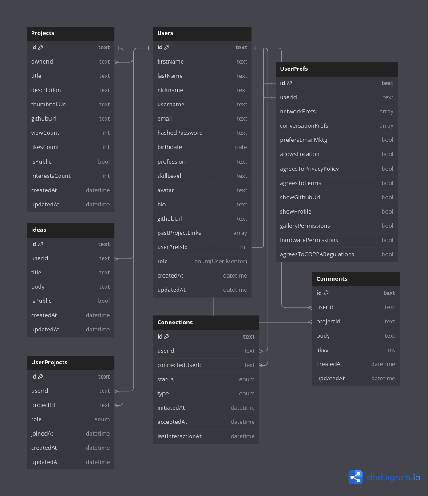

# Database Models Reference

This document serves as a reference for the database models used in the Syncra platform.

## Users

Models the data collected of the User as a User and Mentor of the platform

- id: string
  - Primary key to reference the specified user record
- firstName: string
  - User's legal first name
- lastName: string
  - User's legal last name
- nickname: string
  - User's given last name
- username: string
  - unique 6-20 character credential to identify and authenticate user
- email: string
  - unique email and credential to identify and authenticate user
- hashedPassword: string
  - encrypted version of user's password. Only used to authenticate user upon login
- birthdate: string
  - User's birthdate stored as MMDDYYYY
- avatar: string
  - User's image stored as a url
- bio: string
  - 250-character max bio provided by user
- githubUrl: string
  - The profile link of the user's github
- profession: string
  - User's current occupation
- overallSkillLevel:
  - User's provided confident skill level
- userPrefsId: string
  - id to reference User's preferences while using the app/platform
- role: enum
  - Tracks user's role on platform ("User", "Mentor")
- createdAt: datetime
  - Server timestamp of user's creation of account on platform
- updatedAt: datetime
  - Server timestamp of user's changes to profile on platform

## UserPrefs

Models the preferences of the provided User

- id: string
  - Primary key to reference the specified User Preference record
- userId: string
  - id to reference the User who owns the preference record
- networkPrefs: string
  - array (stored as string) that holds all of user's preferences when working with other users
- convoPrefs: string
  - array (stored as string) that holds all of user's preferences when conversating with other users
- allowsLocation: boolean
  - Boolean that allows user to knowingly opt-in or opt-out of allowing Syncra to use location
- agreesToPrivacyPolicy: boolean
  - Boolean that allows user to knowingly accept Syncra's Privacy Policy. A user can not be a Syncra user unless this is true
- agreesToTerms: boolean
  - Boolean that allows user to knowingly accept Syncra's Terms and Conditions. A user can not be a Syncra user unless this is true
- prefersMarketingNotifications: boolean
  - Boolean that allows user to opt-in or opt-out of Syncra's email marketing newsletters
- showGithubUrl: boolean
- showProfile: boolean
- galleryPermissions: boolean
- hardwarePermissions: boolean
- agreesToCoppaRegulations: boolean

## Projects

Models the data collected of a Syncra Project

- id: string
  - Primary key to reference the specified Project record
- title: string
  - 50-character max title of the project
- description: string
  - 250-character max description of the project
- thumbnailUrl: string
  - Thumbnail image of the project to show when matching or on project page
- githubUrl: string
  - The url to the specified project
- viewCount: integer
  - Stores count of how many users viewed the project
- likesCount: integer
- isPublic: boolean
  - Boolean to store project visibility
- interestsCount: integer
  - Stores count of user's who have clicked that they're interested in project
- ownerId: string
  - id to reference the user that created the project
- createdAt: datetime
- updatedAt: datetime

## Ideas

Ideas are quick drafts of what a User would like to create. These can either be made public so that others can view and collaborate on them or made private to the user. They are not fully projects but can be converted to one.

- id: string
  - Primary key to reference idea record
- userId: string
  - id to reference the user who created the idea
- title: string
  - Title/name of idea
- body: string
  - Serves as details of the idea
- isPublic: boolean
  - Boolean to set visibility of the idea
- createdAt: datetime
- updatedAt: datetime

## Connections

Connections serve as the join table to record User to User connection, whether as User-To-User, User-To-Mentor, etc.

- id: string
  - Primary key to reference specified connection record
- userId: string
  - id to reference current authenticated user who is looking to connect with other user
- connectedUserId: string
  - id to reference the user or mentor the current authenticated is viewing for match or wants to connect with
- status: enum("pending", "matched", "unmatched", "rejected", "blocked")
  - current status of mutual connection. default value is pending.
- type: enum("mentor", "networking")
  - type of connection between both users
- initiatedAt: datetime
  - sets date and time of initial connection request
- acceptedAt: datetime
  - sets date and time of connection acceptance
- lastInteractionAt: datetime
  - Server timestamp of updated connection interaction

## UserProjects

Serves as the join table between a User and a Project Collaboration. While users can own their own projects, they can also be added to other projects.

- id: string
- userId: string
- projectId: string
- role: enum("collaborator", "viewer", "owner")
- joinedAt: datetime
- createdAt: datetime
- updatedAt: datetime

## Comments

A user can make comments to a project that they are associated with

- id: string
- userId: string
- projectId: string
- body: string
- likes: string
